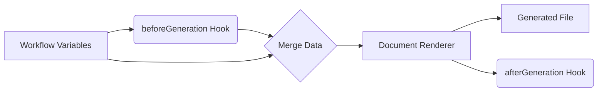

# Document Hooks

Document Hooks are specialized scripts that run exclusively during the execution of a **Final Block**. They are designed to prepare data specifically for document templates (DOCX/PDF) without cluttering the main workflow logic with formatting concerns.

## Available Hooks

### 1. `beforeGeneration`
- **Trigger**: After the Final Block starts, but *before* the document engine replaces placeholders in the template.
- **Context**: Has access to all workflow variables.
- **Use Case**: 
    - Formatting dates (e.g., ISO `2023-12-25` → "December 25, 2023").
    - Formatting currency (`1000` → "$1,000.00").
    - Filtering lists (e.g., remove empty rows before rendering a table).
    - Creating "display-only" variables (e.g., `fullName = firstName + " " + lastName`).
- **Output**: Returns a dictionary of variables. These variables are **merged** into the context used *only* for this document generation. They do NOT persist back to the main workflow state.

### 2. `afterGeneration`
- **Trigger**: After the document file has been created.
- **Context**: Access to workflow variables + metadata about the generated file (filename, size).
- **Use Case**: 
    - Custom audit logging.
    - Conditional behavior based on success.
    - *(Future)* Triggering specific delivery methods.

## Data Flow



## Example: Formatting for Document

**Scenario**: You have a list of shareholders, but the document needs them as a comma-separated string.

**Workflow Variable (`shareholders`):**
```json
[{"name": "Alice"}, {"name": "Bob"}, {"name": "Charlie"}]
```

**Hook (`beforeGeneration`):**
```javascript
// Input Keys: ["shareholders"]
const names = input.shareholders.map(s => s.name);
const displayString = names.join(", "); 

return {
  shareholders_display: displayString // "Alice, Bob, Charlie"
};
```

**Template Usage:**
In the DOCX template, you use `{{shareholders_display}}`.
